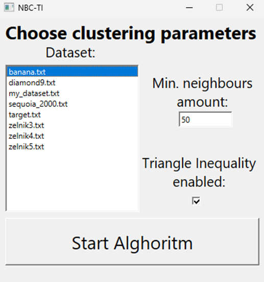
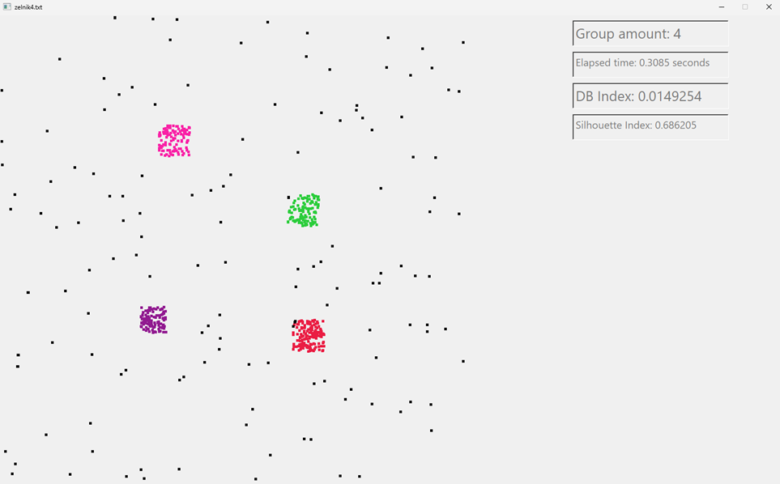

# Projekt MED - Grupowanie danych z wykorzystaniem nierówności trójkąta
### Autor: Paweł Martyniuk
Implementacja algorytmu z artykułu: https://link.springer.com/chapter/10.1007/978-3-642-15381-5_35
Program został napisany w języku C++. Interfejs graficzny stworzony przy użyciu bibiloteki QT.
## Instrukcja
W momencie uruchomienia programu zostanie wyświetlone okno w którym należy zdefiniować parametry algorytmu grupowania.

Na oknie użytkownik może wybrać jeden ze zdefiniowanych wcześniej datasetów albo do folderu data może umieścić własny dataset który po uruchomieniu programu będzie widoczny na liście. Dataset powinien mieć następujący format: „X,Y,” czyli dwie współrzędne rozdzielone przecinkami. Liczba wierszy może być dowolna jednak nie mniejsza od minimalnej liczby sąsiadów. Oprócz tego należy zdefiniować właśnie minimalną liczbę sąsiadów którzy będą szukani dla każdego punktu. A także można zdecydować czy algorytm ma wykorzystywać nierówność trójkąta czy nie.
Po wybraniu datasetu „zelnik4.txt”, 50 sąsiadów i zaznaczonego checkboxa TI widać następujący rezultat.

Zgodnie z rysunkiem widać na różne kolory zaznaczone grupy. Kolorem czarnym został oznaczony szum. Oprócz tego po prawej stronie widać po każdym uruchomieniu algorytmu jaka jest łączna liczba grup, ile czasu zajęło grupowanie danych oraz wartości dwóch wskaźników: Davies Bouldin oraz Silhouette.
